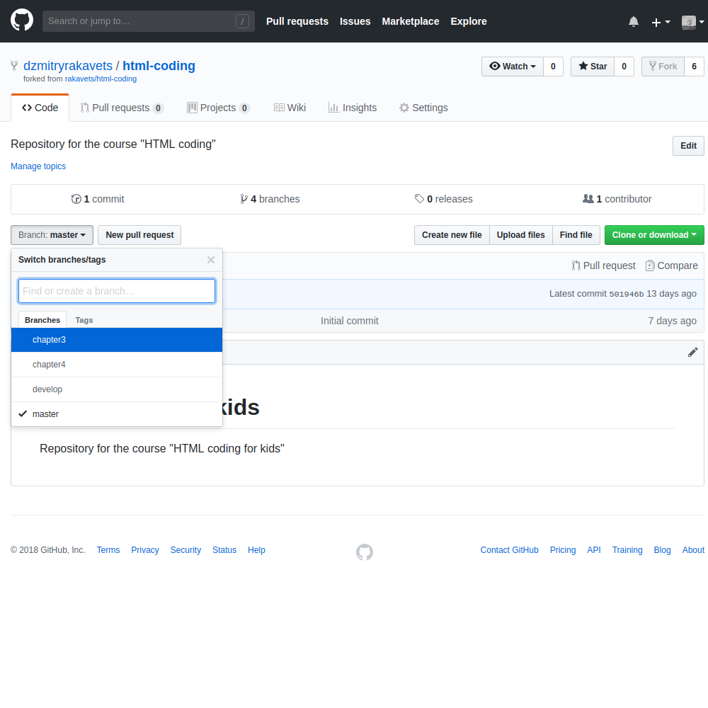
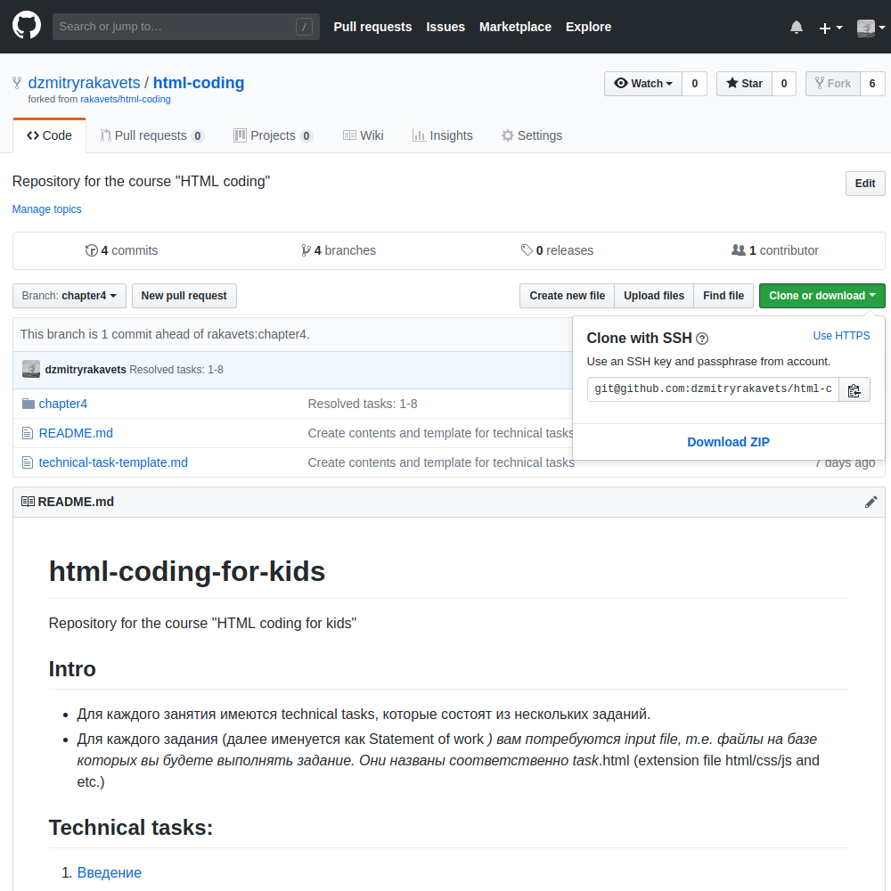
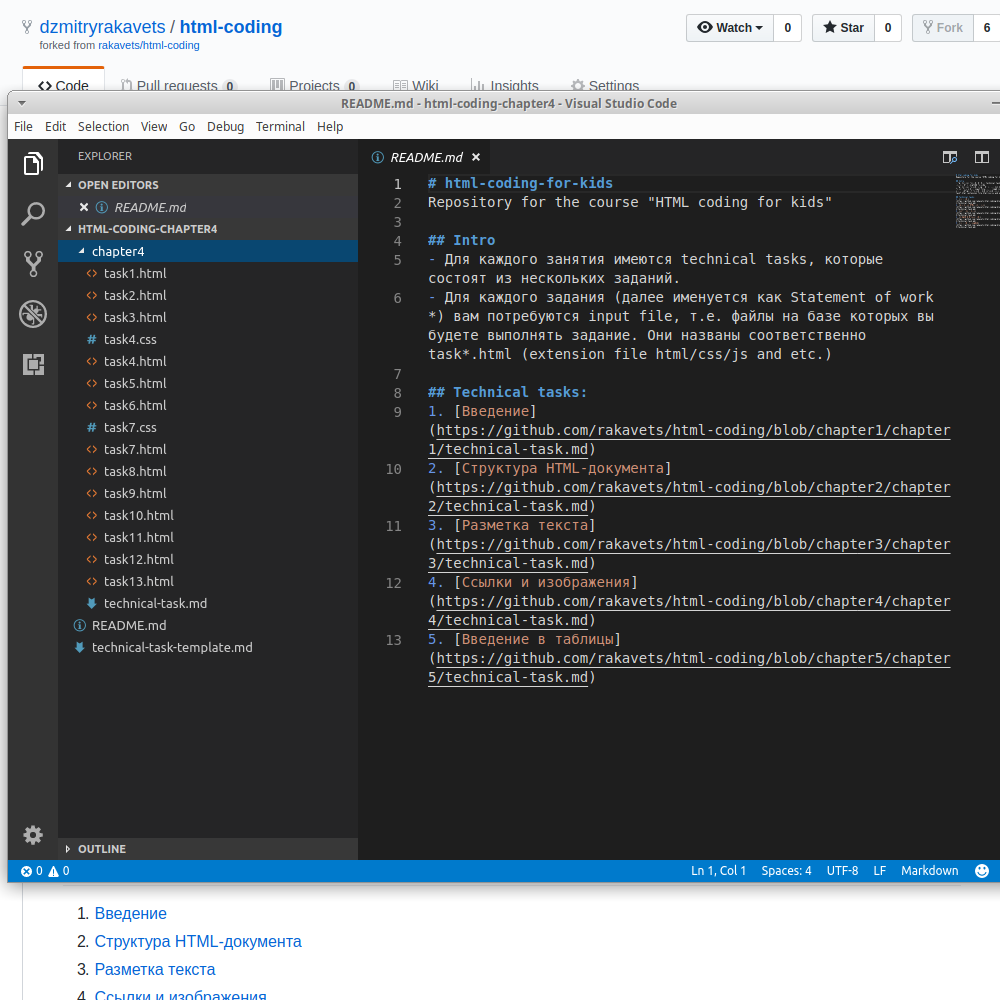

# How to perform a technical specification?

## 1. Sign in [GitHub](https://github.com/)

## 2. Make "Fork" for repository

## 3. Change branch according lesson

## 4. Download ZIP-archive

## 5. Extract archive

## 6. Open directory for lesson in VSCode

## 7. Perform technical specification
## 8. Upload on GitHub

## 9. Make commit

## 10. Create Pull Request

## 11. Wait feedback

## 12. Fix if necessary