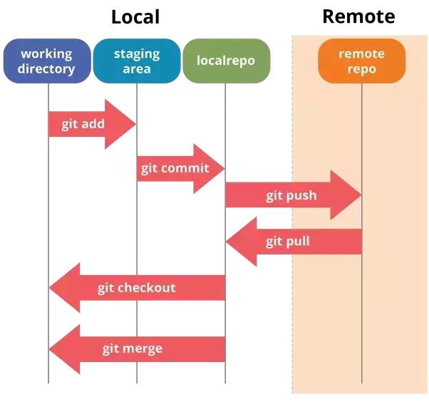

# Command for Git

## Description

- Все команды кроме `git clone` выполняются в `terminal`/`cmd` в directory с проектом
- Команда `git clone` выполняется в directory `dev`, которая должна быть создана в пользовательской directory
- Команды для работы в `cmd`
    - `cd ..` - изменить directory на directory выше
    - `cd dir_name` - изменить directory на directory с именем `dir_name` - directory в которую необходимо перейти и которая находится в текущей directory
    - `c:` - перейти на диск `c`

## Workflow
0. Если небходимо клонируем репозиторий
0. Если необходимо конфигурируем `git`
0. Если необходимо обновляем репозиторий (`remote repository` -> `local repository`)

1. С помощью `IntelliJ IDEA` выполняем задание (`working directory`)
2. Добавляем файлы для отслеживания с помощью `git` (`working directory` -> `staging area`)
3. Фиксируем изменения / Делаем `commit` (`staging area` -> `local repository`)
4. Загружае изменения на `GitHub` (`local repository` -> `remote repository`)

### Как копировать свой репозиторий на компьютер когда его нет на компьютере?

*Необходимо делать единожды*

`git clone https://github.com/rakovets/wiki.git`

где `https://github.com/rakovets/wiki.git` - ссылка на НУЖНЫЙ репозиторий

### Как сконфигурировать git

*Необходимо делать единожды*

`git config --global user.name 'Dmitry Rakovets'`

где `Dmitry Rakovets` - ваше имя

`git config --global user.email 'dmitryrakovets@gmail.com'`

где `dmitryrakovets@gmail.com` - ваш email

### Как посмотреть состояние `working directory`

`git status`

### Как посмотреть `commits` для `local repository`

`git log`

### Как переключать `branch`

`git branch branch_name`

где `branch_name` - имя `branch` в который необходимо переключиться

### Как добавить файлы из `working directory` в `staging area` для предстоящего `commit` 

`git add .`

где `.` - все файлы, можно также использовать имя файла, для добавления только файла

### Как добавить файлы из `staging area` в `local repository` с определенным заголовком 

`git commit -m "Message"`

где `Message` - залоговок который НУЖНО использовать

### Как отправить изменения из `local repository` в `remote repository`

`git push origin`

### Как обновить текущий `local repository`, если произошли изменения в `remote repository`

`git fetch origin`

`git pull origin`

где `origin` - краткое имя `remote repository` с которого необходимо вытянуть изменения

### Как добавит `remote repository` ментора

`git remote add rakovets https://github.com/rakovets/wiki.git`

где `https://github.com/rakovets/wiki.git` - ссылка на НУЖНЫЙ репозиторий